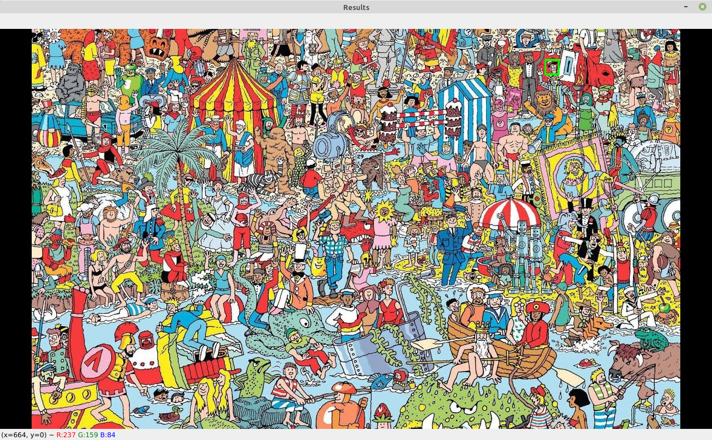

# MicroVisaoArtificial_24-25

# Parte 1

Miguel Riem Oliveira <mriem@ua.pt>

# Sumário

 - Correspondência por modelos

# Exercícios 

## Exercício 1 - Onde está o Wally?

Carregue a imagem *scene.jpg* e o modelo *wally.png*

Utilizando template matching encontre o Wally na imagem.

Anote a posição do Wally desenhando um círculo à volta da sua cara.

## Exercício 2 - Ainda o Wally?

Experimente o programa do exercício anterior para as novas imagens **school.jpg** e **beach.jpg**. Porque não funciona? 

Crie um sistema de carregar e arrastar com o rato que permita ao utilizador rapidamente criar um novo template para utilizar.

## Exercício 3 - Destaca o Wally?

Destaque o Wally detetado colocando todas as zonas da imagem que não são o Wally a cinzento.

## Exercício 4 - Processamento de vídeo

Faça um programa que guarde uma imagem adquirida da câmara do seu portátil.
Depois, corte manualmente uma imagem modelo da sua cara.

Finalmente, faça um programa que carregue a imagem modelo e procure a sua cara nas imagens gravadas em tempo real da câmara do seu portátil.

## Exercício 5 - Nightfall

O objetivo é carregar a imagem _lake.jpg_ do disco e mostrá-la.

Depois deve-se diminuir a intensidade dos píxeis da metade direita da imagem para simular uma fotografia noturna.

Finalmente, faça um efeito de anoitecer progressivo variando o valor do divisor.

Grave um vídeo com o processo de anoitecer da imagem.

