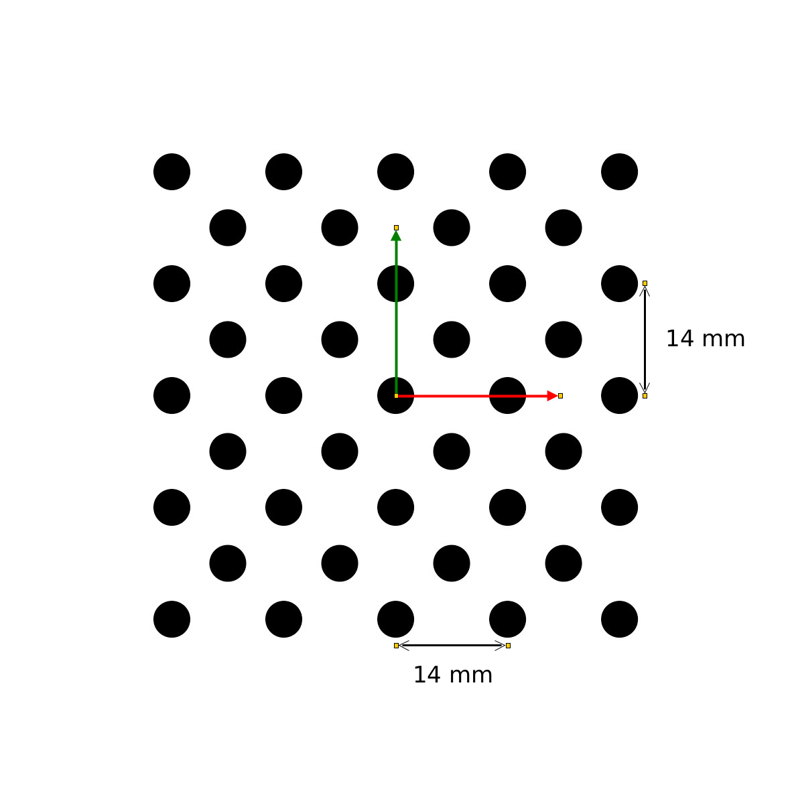

# MicroVisaoArtificial_24-25

# Parte Sherlock

Miguel Riem Oliveira <mriem@ua.pt>

# Sumário

Exercícios em Sherlock

# Exercícios

## Exercício 1

Carregar a sequência de imagens da pasta **screws**.

Criar um programa para contar o número de parafusos na imagem.

## Exercício 2

Carregar a sequência de imagens da pasta **rede**.

Criar um programa que deteta defeitos na rede e indica se a rede está OK ou NOK (not ok).

## Exercício 3

Pretende-se extrair uma imagem com a zona do maior defeito e gravar uma imagem (mais pequena que a original) com essa zona.

Pretende-se ainda calcular a àrea mínima, máxima e média das zonas defeituosas.

## Exercício 4

Carregar a sequência de imagens da pasta **alignment_ocr**.

Pretende-se localizar a peça e criar um alinhamento.

Depois pretende-se:

   1. Ler o texto "LOT ..." com recurso a OCR;
   2. Ler o código de barras em baixo;
   3. Verificar que há nove hexágonos à esquerda na peça.

## Exercício 5

Usando template matching com a função Search Geometric treine o objeto martelo e encontre-o nas imagens.

## Exercício 6

Faça a rotação das imagens na pasta **rotation_alignment** para orientar a peça sempre na vertical.

## Exercício 7

Meça a zona de desgaste das ferramentas de corte da pasta **milling_tool**.

## Exercício 8

Carregar a sequência de imagens da pasta **ampoules**.

Medir a percentagem de enchimento de cada ampola.

## Exercício 9

Carregar a sequência de imagens da pasta **cast**. Usar a opção _directory_.

Medir a àrea da região preta da peça em píxeis. 

## Exercício 10

Carregar a sequência de imagens da pasta **component_presence**.

Verificar se o parafuso no centro da roda está presente.

## Exercício 11

Faça um programa que carregue as imagens **pills** e consiga contar o número de comprimidos verdes presentes em cada imagem.

Depois, usando o algoritmo **color presence** conte os comprimidos de todas as cores e imprima para o ecrâ um relatório em que cada linha indica a quantidade de comprimidos de uma cor.

## Exercício 12

Fazer reconhecimento de cor da imagem **fuses**.
Pretende-se que seja gravada a imagem original a cores anotada com texto a indicar a cor detetada para cada fusível.

## Exercício 13

Fazer reconhecimento de cor  das imagens na pasta **fruits**.
Utilize o padrão de cores **color_pattern** para treinar as cores.

## Exercício 14

Na contrinuação do exercício anterior, faça um programa que envie por TCP/IP a informação do número de peças de fruta de cada cor.

Use o sherlock como client da porta TCP 5033 (poderá ter de cirar uma regra no windows firewall para permitir), e lance um servidor com o programa [hercules](https://www.hw-group.com/software/hercules-setup-utility).

## Exercício 15

Utilize este [exemplo](https://realpython.com/python-sockets/#echo-server) para criar uma servidor em python que receba a informação vinda do sherlock.

## Exercício 16

Fazer calibração métrica usando o seguinte padrão.

## Exercício 17

Depois de obter a calibração do exercício anterior, calcular o diâmtetro médio das frutas das imagens:

 - apples_on_pattern.jpg
 - oranges_on_pattern.jpg

## Exercício 18

Escrever para um ficheiro a informação produzida com a calibração, no formato:

  - Imagem **<idx+0>**. Objetos são **<laranjas|maçãs>**. Há **<num> <laranjas|maçãs>**. O diâmetro médio é **<diam_medio>**.
  - Imagem **<idx+1>**. Objetos são **<laranjas|maçãs>**. Há **<num> <laranjas|maçãs>**. O diâmetro médio é **<diam_medio>**.
  - ...
  - Imagem **<idx+n>**. Objetos são **<laranjas|maçãs>**. Há **<num> <laranjas|maçãs>**. O diâmetro médio é **<diam_medio>**.

