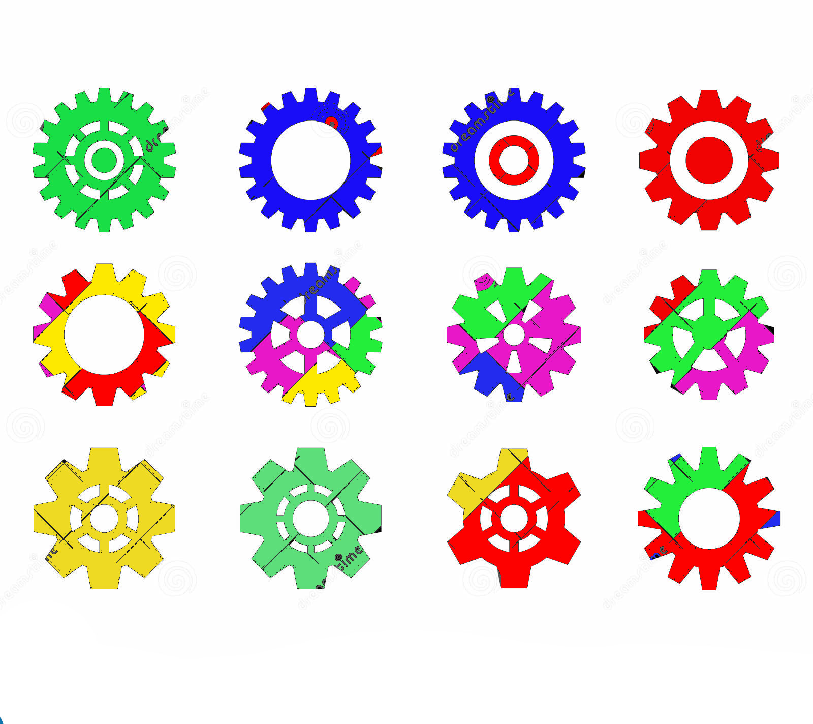
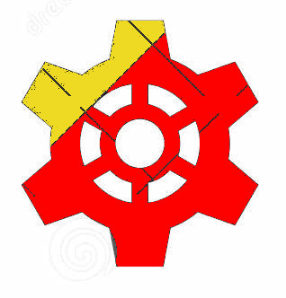

# MicroVisaoArtificial_24-25

# Trabalho Prático


Miguel Riem Oliveira <mriem@ua.pt>


Pretende-se realizar a inspeção de rodas dentadas com vários formatos e cores.



As imagens podem conter uma ou várias rodas dentadas. O programa deverá levar a cabo uama análise por cada roda dentada.

Pretende-se obter as seguintes propriedades para cada roda dentada:
  
   - Àrea total
   - Diâmetro externo
   - Diâmetro do furo do centro
   - Número de dentes
   - Altura dos dentes
   - Número de furos
   - Número de anéis concêntricos
   - Distribuição estatística de cores

Deverá treinar um conjunto de 5 cores: azul, verde, vermelho, amarelo e rosa.
Píxeis de uma mesma cor podem apresentar ligeiras variações nos seus valores de RGB.

Por exemplo, para a roda dentada mostrada em baixo:



o resultado deveria ser (valores estimados manualmente neste exemplo):

Propriedade | Valor
| :---:   | :---: | 
Àrea total | 55800 pixels
Diâmetro externo |  276 pixels
Diâmetro do furo do centro | 54 pixels
Número de dentes | 6 
Altura dos dentes | 39 pixels
Número de furos | 7
Número de anéis concêntricos | 0
Distribuição estatística de cores | 85% amarelo, 14% vermelho, 1% outras


Finalmente, deve ser escrito um ficheiro de texto com o resultado da análise da última imagem, uma propriedade por linha, e um cabeçalho a indicar a data e hora da análise, por exemplo:

```
--------------------------------
Análise 20/6/2024, 18h37
Roda Dentada idx=0:
   Àrea total = 55800 pixels
   Diâmetro externo = 276 pixels
   Diâmetro do furo do centro = 54 pixels
   Número de dentes = 6 
   Altura dos dentes = 39 pixels
   Número de furos = 7
   Número de anéis concêntricos = 0
   Distribuição estatística de cores:
      85% amarelo
      14% vermelho
      1% outras
Roda Dentada idx=1:
   Àrea total = 5800 pixels
   Diâmetro externo = 76 pixels
   Diâmetro do furo do centro = 5 pixels
   Número de dentes = 9 
   Altura dos dentes = 39 pixels
   Número de furos = 7
   Número de anéis concêntricos = 0
   Distribuição estatística de cores:
      75% azul
      5% amarelo
      16% vermelho
      4% outras
--------------------------------
Análise 21/6/2024, 12h30
<...>
--------------------------------
```


